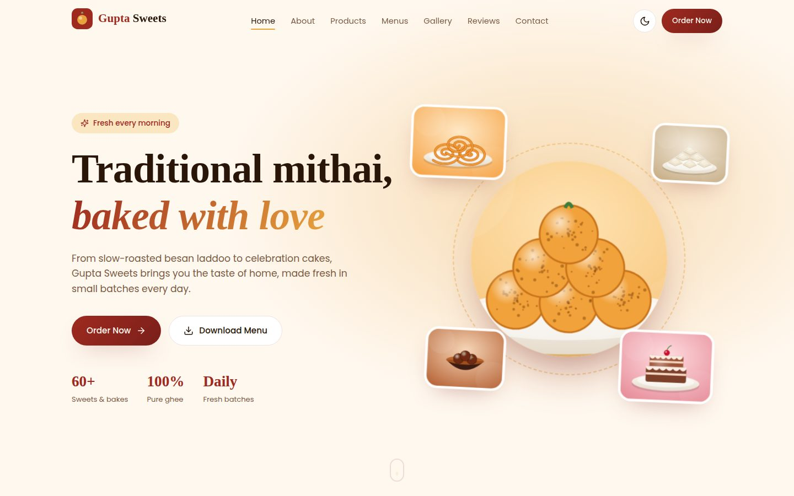
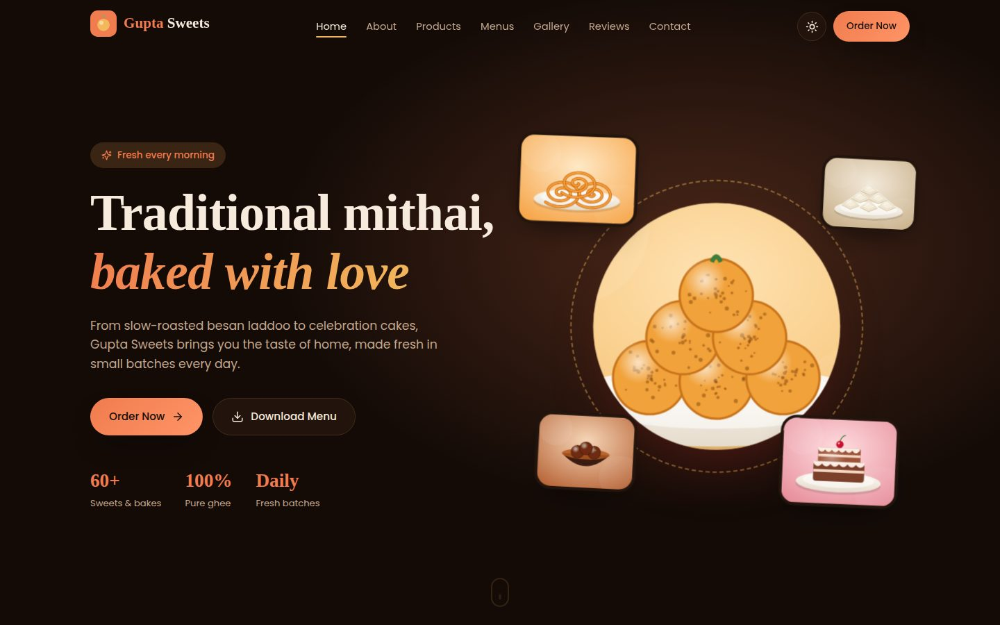
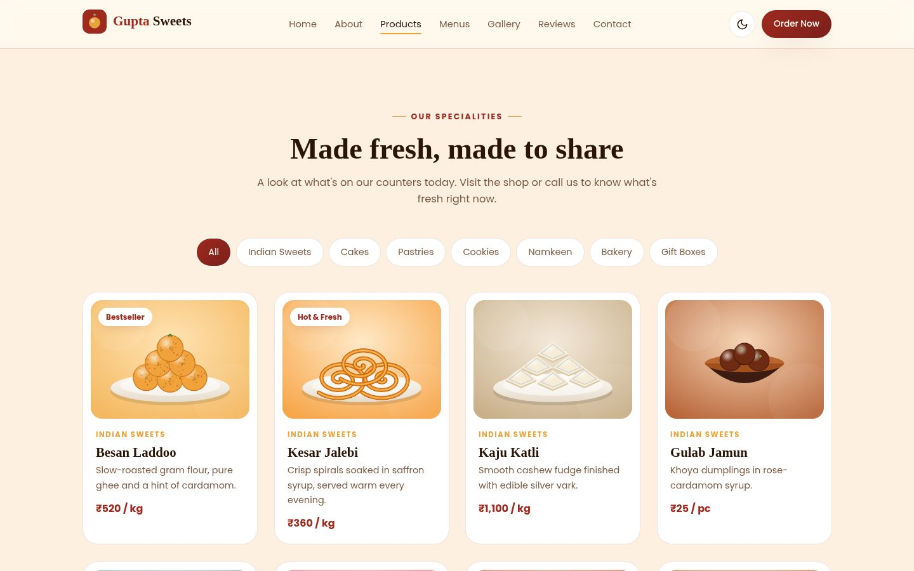
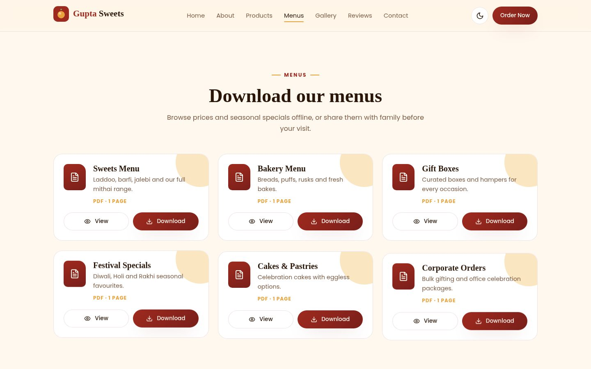
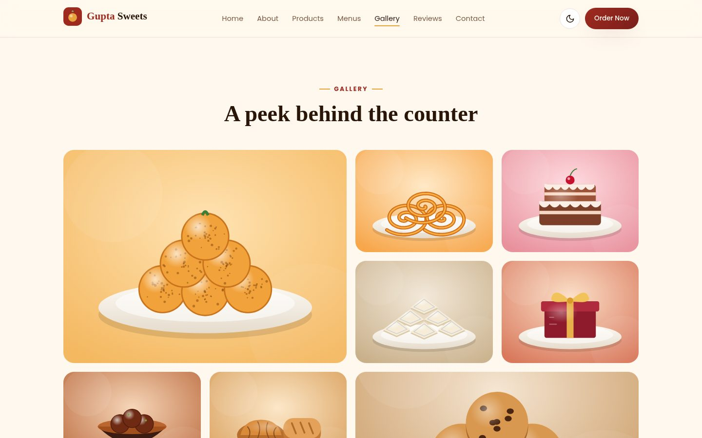
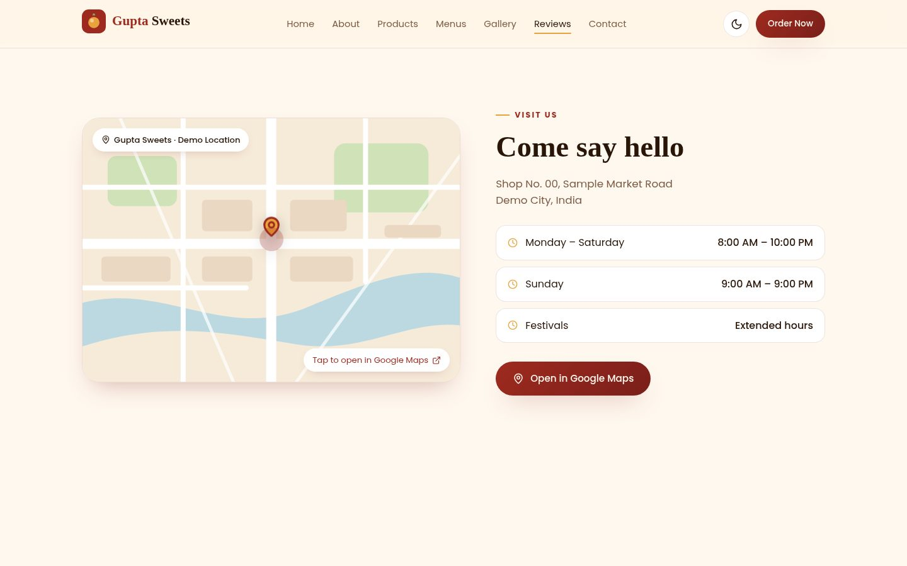
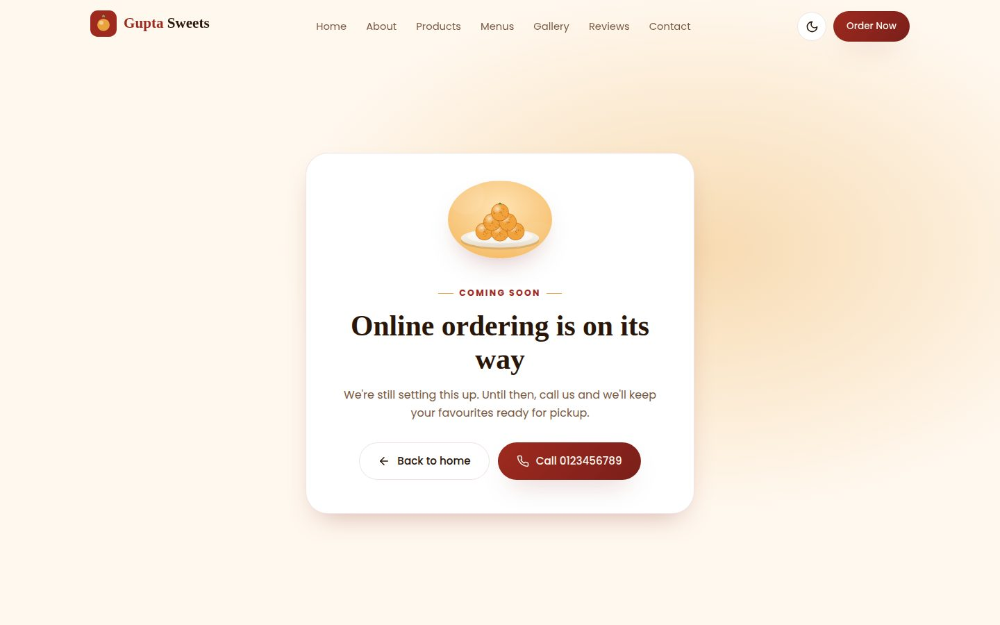
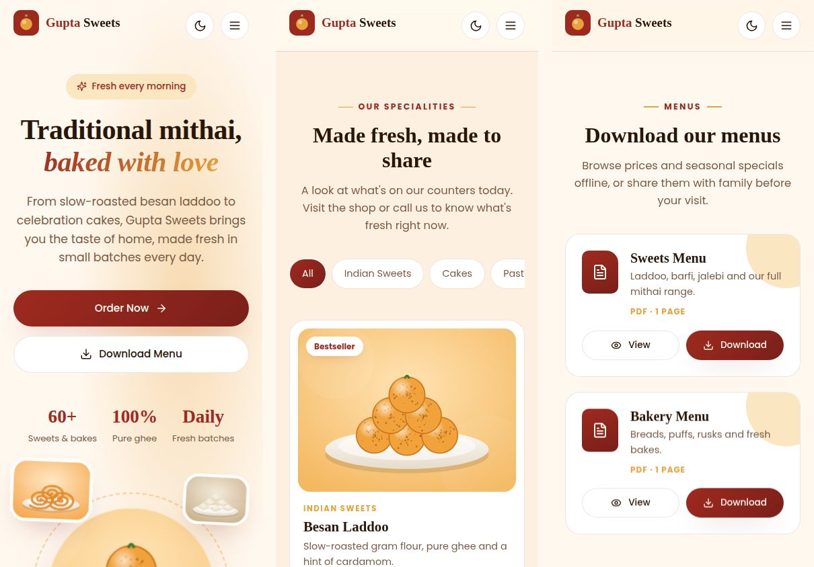

# Gupta Sweets — React Frontend

A static showcase website for **Gupta Sweets**, a sweets and bakery brand, built with React. It has no cart, checkout, login or backend. The aim is a polished, responsive brand site with animations, light and dark themes, downloadable menus and clear contact actions.

**Live site:** _https://gupta-sweets-seven.vercel.app/_
**Repository:** _https://github.com/arjunkadampatil/gupta-sweets_



## Features

- **Responsive layout**, designed mobile-first and checked at phone, tablet, laptop and desktop widths
- **Light and dark mode** with a toggle in the navbar. The choice is saved in `localStorage`, and a small script in `index.html` applies it before React loads, so the page doesn't flash the wrong theme on refresh.
- **Sticky, blurred navbar** that highlights the section on screen, with a full-screen mobile menu (closes on Escape)
- **3D hero scene**: sweets float at different depths and the whole scene tilts with the mouse (Framer Motion springs with CSS `perspective` and `preserve-3d`)
- **3D tilt product cards** with category filters and an animated active pill
- **Branded loading screen** that waits for fonts and assets, plus skeleton loaders for product cards and every image
- **Download Menu section** with 6 working sample PDFs, each with View and Download buttons
- **Gallery** with a bento-style grid and a keyboard-friendly lightbox (arrow keys and Escape)
- **Reviews carousel** that auto-plays, pauses on hover or focus, and has arrows and dots
- **Location section** with an illustrated map preview, a pin and an "Open in Google Maps" link
- **Contact actions** for Call, Email, WhatsApp and Maps, all using real `tel:`, `mailto:`, `wa.me` and Google Maps links
- **Order Now / Shop Now** buttons that only lead to a "Coming soon" page at `/order` and `/shop`. Nothing is submitted or stored.
- **Extras**: festive gift box banner, animated counters, store timings, FAQ accordion, Privacy Policy, Terms & Conditions and a 404 page

## Tech stack

| Purpose | Library |
| --- | --- |
| UI | React 18, Vite 5 |
| Routing | React Router 6 |
| Animation | Framer Motion |
| Icons | Lucide React |
| Styling | Plain CSS with custom properties (theme tokens), one stylesheet per component |
| Sample PDFs | Python + ReportLab (`scripts/generate_pdfs.py`) |

## Getting started

```bash
npm install
npm run dev      # http://localhost:5173
npm run build    # production build in dist/
npm run preview  # serve the production build locally
```

## Project structure

```
src/
├── components/        Navbar, Hero, About, Products, ProductCard, FestiveBanner,
│                      DownloadMenu, PdfDownloadCard, Gallery, Reviews, ReviewCard,
│                      LocationSection, Faq, Contact, Footer, LoadingScreen,
│                      SkeletonLoader, SmartImage, Reveal, Logo
├── pages/             Home, ComingSoon (/order, /shop, 404), Legal (privacy, terms)
├── context/           ThemeContext (theme state + persistence)
├── data/              site.js (business info + location), products.js, pdfs.js, reviews.js
├── assets/images/     Original SVG illustrations
├── styles/            global.css (theme tokens, buttons, skeleton, loader)
├── App.jsx            Routes, loading screen, scroll handling
└── main.jsx
public/pdfs/           The 6 sample menu PDFs
scripts/               generate_pdfs.py
```

### Changing business details or the map location

Everything lives in `src/data/site.js`. To switch to the real shop, update `LOCATION.lat`, `LOCATION.lng` and `LOCATION.addressLines`. The map pin, the Google Maps buttons and the footer all read from it.

## Design decisions

- **Palette:** deep maroon and saffron gold on a warm cream background, the colours of a traditional mithai box. Dark mode keeps the same warmth with a cocoa background instead of grey.
- **Typography:** Playfair Display for headings to give a premium, editorial feel, and Poppins for body text to keep it readable.
- **Illustrations instead of stock photos:** every food image is an original SVG made for this project. They load instantly, look sharp at any size, need no licences and keep the visual style consistent. They can be swapped for real product photos later without changing any component.
- **Map preview:** an illustrated SVG map rather than an embedded map, so it needs no API key, always renders, and matches the light and dark themes. Clicking it opens the real coordinates in Google Maps.
- **Animation budget:** motion is used for depth and feedback, not decoration. All entrance animations run once, the 3D effects only use `transform` and `opacity`, and everything respects `prefers-reduced-motion`.
- **Scope:** product cards have no prices tied to logic, no quantity selectors and no add-to-cart. Order and Shop buttons go to a placeholder route, as the brief requires.

## Performance and accessibility

- Images are lazy-loaded, with skeletons until each one has loaded
- React, React Router and Framer Motion are split into separate cached chunks, and the secondary pages are lazy-loaded
- `memo` on list cards and `useMemo`/`useCallback` where lists or handlers would otherwise be recreated
- Semantic landmarks (`header`, `nav`, `main`, `section`, `footer`, `address`), visible focus rings, ARIA labels on icon buttons, and `aria-expanded` on the menu and FAQ
- The lightbox and mobile menu close with Escape, and the carousel pauses while it has focus

## Screenshots

| Dark mode | Products |
| --- | --- |
|  |  |

| Download menus | Gallery |
| --- | --- |
|  |  |

| Location | Order Now placeholder |
| --- | --- |
|  |  |

**Mobile**



## Sample PDFs

| File | Contents |
| --- | --- |
| `gupta-sweets-sweets-menu.pdf` | Mithai range |
| `gupta-sweets-bakery-menu.pdf` | Breads, puffs, cookies |
| `gupta-sweets-gift-boxes.pdf` | Gift boxes and hampers |
| `gupta-sweets-festival-specials.pdf` | Diwali, Holi, Rakhi specials |
| `gupta-sweets-cakes-pastries.pdf` | Cakes and pastries |
| `gupta-sweets-corporate-orders.pdf` | Bulk and corporate gifting |

To regenerate them: `pip install reportlab && python3 scripts/generate_pdfs.py`

## Deployment

The site is fully static. `vercel.json` and `public/_redirects` send every route to `index.html`, so `/order`, `/shop` and the legal pages work on refresh.

- **Vercel:** import the repository. The framework preset is Vite, the build command is `npm run build` and the output folder is `dist`.
- **Netlify:** the same build command and publish folder.

## Notes

- Phone, email, address, prices and reviews are sample content for the demo.
- Social media icons in the footer are placeholders until real handles are available.
